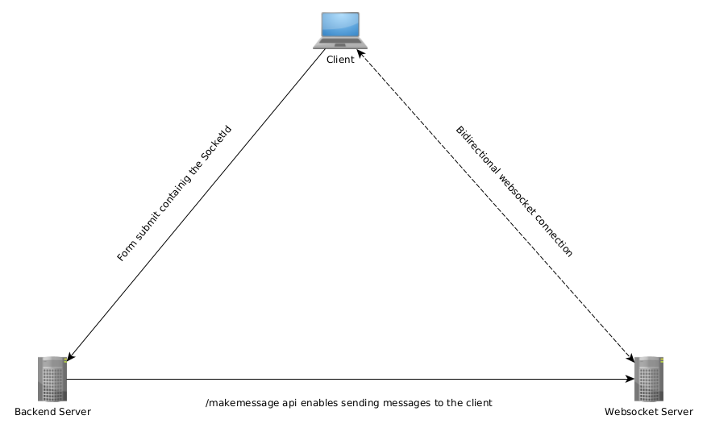

# Asynchronous connection to backend

The easyiest way to use this module is to use the ajax form submit functionallity implemented in __index.html__.
You only need to customize you form-inputs and the POST URL.
In your backend you can parse the request body for _inputs_ and _socketId_.

Now you can use the socket-API:  

```   
URL: localhost:3001/makemessage


PARAMS:

uuid: The socketId,

msg: The message you want to send to the socket

```
## How it works



